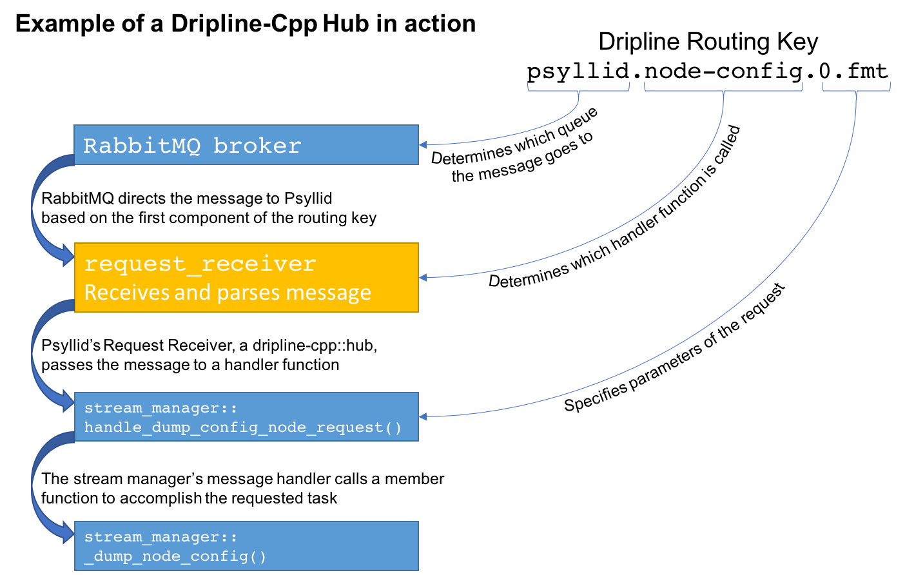

================
Dripline Library
================

The dripline-cpp library contains the following classes that are intended for use:

* service: You want simple send and receive capabilities

* hub: You want to receive messages and handle them with C++ function calls

* relayer: You want to send messages asynchronously, and optionally wait for a reply

Service
=======

A service has simple send and receive capabilities.  A class that inherits from service should 
override the ``on_X_message()`` functions according to the type(s) of messages it is setup to handle: 
``request``, ``reply``, and ``alert``.

Hub
===

A hub is a service that is setup to receive requests and maps routing key specifiers to C++ handler functions.  
This allows you to, for example, receive requests intended for a variety of destinations within 
a single application and have the requests distributed accordingly.

Relayer
=======

A relayer allows a user to asynchronously send messages.  Replies can be waited on (either in the user's thread 
or by setting up a thread to wait and then do something once it arrives) or ignored.
