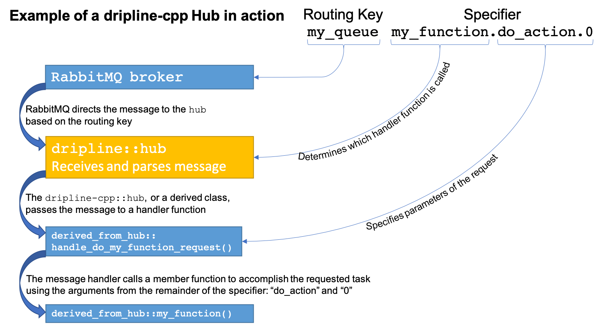

.. _library:

================
Dripline Library
================

The "end-user" aspects of the dripline-cpp API can be divided into core dripline implementations:

* :ref:`Agent<agent>`: sends messages (primarily used by the :ref:`agent`)
* :ref:`Endpoint<endpoint>`: receives messages and acts on them
* :ref:`Service<service>`: primary connection with the broker; can have child endpoints and is an endpoint itself
* :ref:`Messages<messages>`: concrete implementations of the request, reply, and alert message concepts

and useful extensions:

* :ref:`Hub<hub>`: service that dispatches requests to C++ functions (or function-like objects)
* :ref:`Monitor<monitor>`: listens to messages on a mesh (primarily used by the :ref:`monitor`)
* :ref:`Relayer<relayer>`: asynchronously sends messages

There are also a number of classes that implement various features of the above classes:

* :ref:`Core<core>`: interface for the RabbitMQ client library; interface includes interacting with the broker and for sending and receiving messages
* :ref:`Heartbeater<heartbeater>`: implements the heartbeat behavior
* :ref:`Message Dispatcher<message-dispatcher>`: manages the rmqcpp Consumer lifecycle and dispatches assembled Dripline messages
* :ref:`Receiver<receivers>`: collects Dripline message chunks and assembles them into complete messages
* :ref:`Scheduler<scheduler>`: executes scheduled events
* :ref:`Specifier<specifier>`: parses specifier strings
* :ref:`Version Store<version-store>`: stores version information for a particular application context

Core Behavior
=============

.. _agent:

Agent
-----

An ``agent`` takes command-line arguments and sends messages accordingly.  It is primarily used 
for the :ref:`dl-agent` application.

.. _endpoint:

Endpoint
--------

The ``endpoint`` is the basic dripline object capable of handling requests.  

An implementation of a particular endpoint should be a class that inherits from ``endpoint``.

.. _service:

Service
-------

The ``service`` class implements the fundamental "service" concept in dripline: 
it's the basic work unit in a dripline mesh.  It maintains the connection to the broker 
that's used by one or more endpoints, and it is itself an endpoint.

It's range of capabilities are largely defined by the classes it inherits from:

* ``core``
* ``endpoint``
* ``message_dispatcher``
* ``heartbeater``
* ``scheduler``

The interface for running a service consists of three functions:

* ``start()``
* ``listen()`` (blocking)
* ``stop()``

Or you can use ``run()`` to perform the start-->listen-->stop sequence.

A service can have both synchronous and asynchronous child endpoints.  With the former, requests are 
handled synchronously with the receiving of messages and with processing messages bound for itself.  
With the latter, requests are passed to the appropriate endpoint, which handles them in its own thread.

Message delivery is handled by rmqcpp's internal thread pool via callbacks.  Dripline-cpp manages 
only the following threads:

* **Heartbeat thread** — sends regular heartbeat messages (optional)
* **Scheduler thread** — executes scheduled events (optional)

.. _messages:

Messages
--------

The message classes encapsulate the information in dripline messages as C++ objects.

The set of classes comprise the base class, ``message``, and the concrete classes ``msg_alert``,
``msg_reply``, and ``msg_request``.

Message objects know how to convert between themselves and AMQP message objects.

Useful Extensions
=================

.. _hub:

Hub
---

A hub is a service that is setup to receive requests and maps specifiers to C++ handler functions.  
This allows you to, for example, receive requests intended for a variety of destinations within 
a single application and have the requests distributed accordingly.

.. _monitor:

Monitor
-------

A ``monitor`` listens for messages sent to a particular set of keys and prints them to the terminal.

It is used primarily for the :ref:`dl-mon` application.

.. _relayer:

Relayer
-------

A ``relayer`` allows a user to asynchronously send messages.  Replies can be waited on in a thread-safe way 
(either in the user's thread or by setting up a thread to wait and then do something once it arrives) 
or ignored.

Other Classes
=============

.. _core:

Core
----

The ``core`` class provides an interface for the basic AMQP functionality.  It wraps the 
rmqcpp RabbitMQ API in a dripline-specific interface.

The class includes a number of static utility functions for interacting with the broker.

It further includes a complete interface for sending messages.

.. _heartbeater:

Heartbeater
-----------

The ``heartbeater`` class is used by ``service`` or any other client code 
to repeatedly sends a heartbeat on a particular time interval.

The heartbeat is an alert sent to a pre-determined routing key, which is given as a parameter to the 
``execute()`` function.  The interval for sending the heartbeats is ``f_heartbeat_interval_s``, 
which is in seconds.  The default interval is 60 s.

.. _message-dispatcher:

Message Dispatcher
------------------

The ``message_dispatcher`` class manages the lifecycle of an rmqcpp Consumer
(via ``start_listening()`` / ``stop_listening()``) and dispatches each assembled
Dripline message to ``submit_message()``.

Message delivery is callback-based: rmqcpp's internal thread pool invokes the delivery
callback, which passes each AMQP message chunk to ``receiver::handle_message_chunk()``.
Once all chunks of a Dripline message have arrived, the assembled message is dispatched
synchronously to ``submit_message()`` in the rmqcpp callback thread.

A class deriving from ``message_dispatcher`` must implement ``submit_message()`` to define
what happens with each received message.  The two concrete implementations in dripline-cpp are:

* ``service`` — dispatches messages to itself or to its child endpoints
* ``endpoint_listener_receiver`` — a decorator class that wraps a plain ``endpoint`` and adds
  ``message_dispatcher`` capabilities, allowing it to act as an asynchronous child endpoint of a ``service``

.. note::
   Prior to the rmqcpp migration, this class was named ``concurrent_receiver``.  The name was changed
   because the class no longer manages any concurrency itself — rmqcpp's thread pool handles delivery.

.. _receivers:

Receiver
--------

A receiver is able to collect Dripline message chunks and reassemble them into a complete dripline message.

Dripline messages can be broken up into multiple chunks, each of which is transported as an AMQP message.  
A receiver is responsible for handling message chunks, storing incomplete dripline messages, and eventually
processing complete dripline messages.

When a message chunk arrives via ``handle_message_chunk()``, it is stored in the incoming-message map.
Message chunks for a given message can be received in any order.  Once all chunks for a message have
arrived, ``process_message_pack()`` is called inline (no separate thread is spawned).

Stale incomplete messages (entries older than ``single_message_wait_ms`` ms) are lazily evicted at the
start of each ``handle_message_chunk()`` call.

The ``receiver`` class contains an interface specifically for users waiting to receive reply messages:
``wait_for_reply()``.  This uses a ``std::future`` to wait for the reply, which is fulfilled by the
reply consumer's callback when the reply arrives.

.. _scheduler:

Scheduler
---------

The ``scheduler`` executes scheduled events.  
An event is an executable object (e.g. a std::function object, or a lambda) 
with the signature `void ()`.

Events can be one-off, scheduled for a particular time, or they can be repeating, 
scheduled with an interval starting at a particular time.  The default start time for 
repeating events is "now."

.. _specifier:

Specifier
---------

Message specifier strings of the form ``"my.favorite.command"`` are tokenized 
into an array of strings: ``["my", "favorite", "command"]``.

.. _version-store:

Version Store
-------------

The ``version_store`` is a singleton class to store all version information relevant in any particular context.
